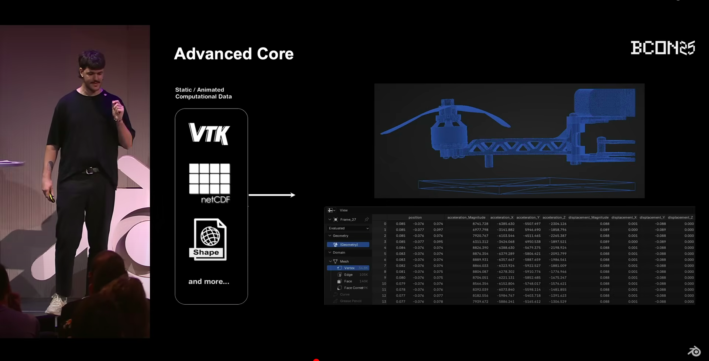

Mathematician graduated from the University of Valencia, specialized in Artificial Intelligence applied to flow prediction in cardiovascular diseases. I am passionate about software development and scientific visualization, focusing on creating innovative tools for the analysis and interpretation of complex scientific data.

Alongside my academic work, I have been a Blender user for 8 years. This experience includes four years as a freelance 3D artist, completing projects for over 100 international companies.

I developed SciBlend:
"SciBlend: Advanced Data Visualization Workflows within Blender” (https://doi.org/10.1016/j.cag.2025.104264), which introduces a modular suite for scientific visualization built on Blender, enabling high-quality 3D representations of scientific data for real-time animations, interactive exploration, and photorealistic rendering of multiple computational data files that are not native to Blender, such as VTK, Shapefiles or netCDF.

I presented SciBlend at the Blender Conference 2025. Watch the talk by clicking the image:

<!-- 

-->

